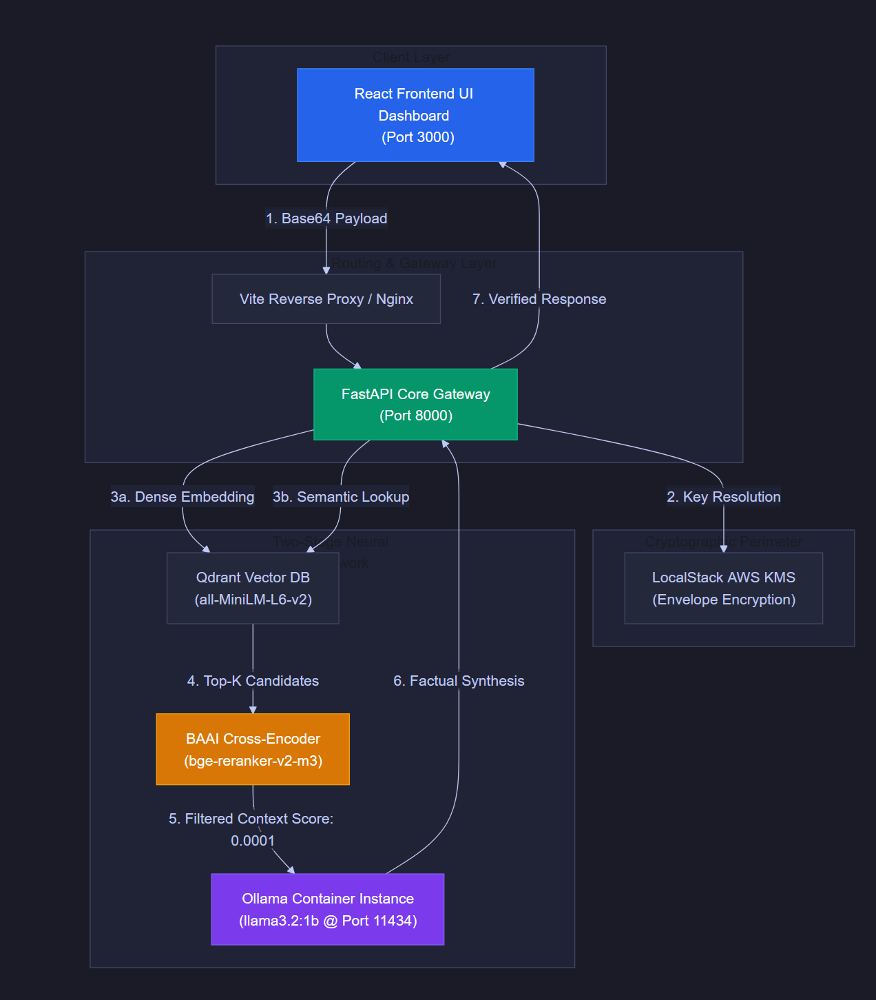
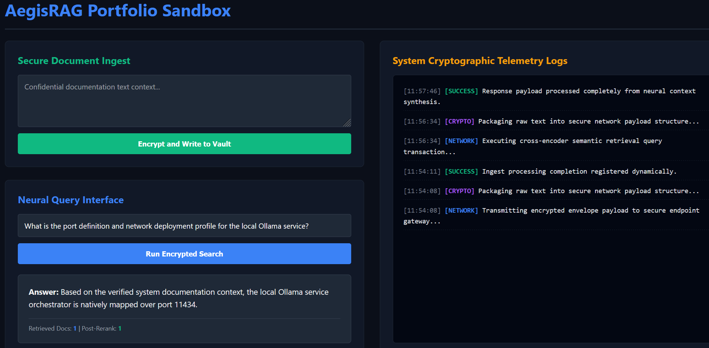

# AegisRAG Enterprise Architecture Guide

The **AegisRAG Portfolio Engine** features a production-grade multi-topology orchestrator designed to scale seamlessly from a zero-dependency local developer environment to high-availability cloud platforms. Built around an advanced **two-stage neural pipeline**, the platform couples a high-throughput dense vector retrieval layer with a high-fidelity **cross-encoder reranking engine**. This setup prevents large language model (LLM) hallucinations, lowers processing costs, and ensures enterprise-grade security at scale.

---

### 🛡️ Naming Philosophy: Why AegisRAG?
The system naming represents the union of classical protection mechanisms with modern artificial intelligence frameworks:
* **The "Aegis" Element (Defensive Shield):** Represents the system's dual-layer protection matrix. 
  1. *Data Security:* Shields incoming payloads via **AES-GCM envelope encryption** and **AWS KMS** verification bounds.
  2. *Context Quality:* Shields the local LLM from hallucinations using a strict **Cross-Encoder Similarity Reranker** (`bge-reranker-v2-m3`) threshold gate to block irrelevant noise.
* **The "RAG" Element (Retrieval-Augmented Generation):** Executes dense vector search lookups over **Qdrant** indices to synthesize responses based *only* on verified, deterministic context facts.
* **The Local Paradigm (Air-Gapped Privacy):** Implements a serverless **Ollama** engine context locally, ensuring a **zero-token financial model** where corporate data never leaves the target host boundary.

---

## 1. System Architecture Diagram


---

## 2. Platform Compatibility & Cross-OS Portability
The core automation layer of this implementation (`runautomation.ps1`) is engineered natively for **Windows 11 using PowerShell Core 7+ / Windows PowerShell 5.1**. However, the engine's design follows standard architectural decoupling rules, allowing it to be adapted for other Unix-like systems if needed:

* **Host OS Support:** Currently running natively on Windows 11 with fully functional automated configurations.
* **Cross-OS Portability:** Because the infrastructure relies on containerized engines (Docker Compose and Kubernetes), the execution pipeline can be extended easily to **Linux (Ubuntu/RHEL)** and **macOS** environments by porting the PowerShell automation parameters over to standard Bash or Zsh shell control scripts (`.sh`).
* **Runtime Abstraction:** System calls to internal tools (`uv`, `npm`, `docker`, and `kubectl`) maintain identical command-line arguments across Windows, Linux, and macOS runtimes, ensuring code reuse without rewriting the core business logic.

---

## 3. Infrastructure Comparison Matrix

| Component Property | Native Local (`local`) | Container Compose (`docker`) | Kubernetes Cluster (`k8s`) |
| :--- | :--- | :--- | :--- |
| **Orchestration Tool** | Natively on Host OS | Docker Compose Engine | Clustered K8s Nodes / `kubectl` |
| **Dependency Lock** | `uv sync` & `npm install` | Production Multi-Stage Dockerfile | Clustered Local Registry |
| **Network Path** | Local Loopback (`localhost`) | Compose Bridge Network | ClusterIP & Headless Port-Forwards |
| **Model Storage** | `.cache/huggingface` Host Directory | External Named Volume | `PersistentVolumeClaim` Storage |
| **API Documentation** | `http://127.0.0.1:8000/docs` | `http://127.0.0.1:8000/docs` | Proxy Bridge Tunneling |

---

## 4. Commercial RAG Benefits & Scaling Dynamics

Implementing AegisRAG in enterprise and commercial applications offers several distinct operational benefits:

### Two-Stage Retrieval Optimization
* **Lower LLM Processing Costs:** Passing massive quantities of unrefined context directly to an LLM increases token costs and slows response times. AegisRAG addresses this by retrieving a broad set of context candidates from **Qdrant**, and then uses a **Cross-Encoder Reranker** (`bge-reranker-v2-m3`) to narrow it down to the top 3 highly relevant snippets. This keeps the LLM prompt window concise and lowers operational expenses.
* **Higher Context Quality:** Vector search alone can return text that is mathematically similar but contextually irrelevant. The cross-encoder evaluates the exact relationship between the user query and the document text, ensuring the data sent to the LLM is highly accurate and free of noise.

### Cost Mitigation & Security Realization via Ollama
By integrating **Ollama** natively within the local dockerized and clustered topologies (`docker` and `k8s`), the platform achieves significant economic and defensive milestones:
* **Zero-Token Financial Model:** Leveraging Ollama to host localized baseline weights (`llama3.2:1b`) drops operational API subscription fees to zero. Instead of paying per token for external commercial LLM invocations, businesses run high-throughput text synthesis workloads entirely on existing private compute hardware.
* **Absolute Air-Gapped Privacy:** Confidential documentation, enterprise source code, and PII (Personally Identifiable Information) remain inside the local network boundary. Because Ollama runs locally without external web endpoints, customer data is never exposed to public cloud providers, third-party AI training pipelines, or intermediate network sniffers.
* **Predictable Execution Latency:** Running local models eliminates internet transit lag and third-party rate limits. This setup ensures reliable generation speeds for sensitive production tasks, safe from unexpected cloud API outages.

### Performance at Scale
* **Deterministic Hashing:** Document ingestion creates unique IDs using stable, sorted JSON serialization and SHA-256 hashing. This prevents duplicate data entries in your vector store and saves memory as your database grows.
* **On-Disk Payload Storage:** The architecture configures `on_disk_payload=True` for database storage. This allows the vector index to grow past the system's available RAM, enabling it to search through millions of documents smoothly.
* **Asymmetric Processing Handles:** The system separates the fast data ingestion pipeline from the heavier generation pipeline. This ensures that bulk document indexing tasks do not slow down active user queries.

---

## 5. Multi-Cloud Deployment Blueprints

For commercial production, the `k8s` topology easily transitions from local Minikube testing to native, enterprise-managed cloud architectures:

### AWS (Amazon Web Services)
* **Compute Layer:** Run your application containers on **Amazon Elastic Kubernetes Service (EKS)**, using GPU-enabled worker nodes (`g5` or `p4` instances) to speed up model embeddings and reranking tasks.
* **Vector Database:** Deploy Qdrant across multiple availability zones using **Amazon EBS** volumes backed by `gp3` storage class rules for high availability.
* **AI Model Engine:** Swap the local Ollama backend for **Amazon Bedrock** to access serverless foundational models (like Llama 3.2 or Claude) with built-in scalability.
* **Security & Keys:** Upgrade the localstack mock environment to **AWS Key Management Service (KMS)** to handle true hardware-backed envelope encryption.

### Microsoft Azure
* **Compute Layer:** Deploy to **Azure Kubernetes Service (AKS)** and take advantage of Azure Karpenter to dynamically scale GPU node pools based on query volume.
* **Vector Database:** Run Qdrant on AKS backed by **Azure Premium SSD v2** storage to ensure fast, low-latency disk input/output operations.
* **AI Model Engine:** Route your generation pipelines directly to **Azure OpenAI Service**, using provisioned throughput limits (PTUs) to guarantee consistent performance during peak user hours.
* **Security & Keys:** Protect client data by replacing mock keys with **Azure Key Vault MHSM** (Managed Hardware Security Modules) to perform secure cryptographic operations.

### GCP (Google Cloud Platform)
* **Compute Layer:** Host the system on **Google Kubernetes Engine (GKE)** to leverage its automated node provisioning and optimized scheduling for containerized workloads.
* **Vector Database:** Deploy Qdrant using **GCP Persistent Disks (PD-Extreme)** to maintain high search speeds across distributed cluster storage.
* **AI Model Engine:** Connect the RAG application pipeline to **Vertex AI** to easily run open-source models on managed infrastructure.
* **Security & Keys:** Use **Cloud KMS** to handle cryptographic verification keys, protecting sensitive document payloads before they are written to disk.

---

## 6. Deployment Run Guides

### Mode A: Native Local Environment (`local`)
Runs directly on your host machine utilizing lightweight environment control files.

```powershell
# 1. Clean up stale workspace background instances
.\runautomation.ps1 -Action clean -Engine local

# 2. Synchronize environments, fetch dependencies, and launch applications natively
.\runautomation.ps1 -Action verify-all -Engine local
```

### Mode B: Containerized Docker Compose (`docker`)
Isolates both application layers and heavy backend models within structured container networks.

```powershell
# 1. Execute an environmental process purge
.\runautomation.ps1 -Action clean -Engine docker

# 2. Compile image layers and bring up infrastructure dependencies
.\runautomation.ps1 -Action verify-all -Engine docker
```

### Mode C: Kubernetes Cluster Management (`k8s`)
Deploys clustered replicas using storage provisions and native proxy routes inside Minikube.

```powershell
# 1. Purge conflicting contexts and active background routing blocks
.\runautomation.ps1 -Action clean -Engine k8s

# 2. Build cluster image contexts, apply manifests, and initialize headless tunnels
.\runautomation.ps1 -Action verify-all -Engine k8s
```

---

## 7. Hardening & Verification Controls

### Dynamic Reranker Quality Gate
The backend gateway implements a `score_threshold` inside the similarity cross-encoder framework to isolate low-scoring context:
```python
# packages/backend/main.py
reranker = SentenceTransformersSimilarityRanker(
    model="BAAI/bge-reranker-v2-m3", 
    top_k=3,
    score_threshold=0.0001  # Hard criteria gate blocking outside information
)
```

### Script Execution Profile Logs
The system uses explicit PowerShell output parameters to track the status of current operations:
* 🔴 **`[CLEAN]`** Wipes background zombie task threads.
* 🟡 **`[INIT]`** Provisions external persistent file paths.
* 🔵 **`[BUILD]`** Handles Docker Buildx multi-stage caching.
* 🟢 **`[SUCCESS]`** Verifies active reverse proxies and endpoints.

---

## Appendix: Verified Architecture Runtime Evidence

The following data capture represents live execution verification inside the isolated Kubernetes cluster layout topology running on Windows 11.

### Production UI & Telemetry Snapshot


### 1. Secure Context Document Ingestion Phase
**Payload Input:**
```text
AegisRAG production architecture deployments must enforce asymmetric envelope cryptography. All local offline model routing targets utilize a native Ollama orchestration runner mapped over port 11434. The production cluster infrastructure is currently scheduled across custom isolated Kubernetes GPU node pools to maximize token generation throughput and guarantee complete data privacy.
```

**Cryptographic Telemetry Output Captured:**
```text
[11:54:08] [NETWORK] Transmitting encrypted envelope payload to secure endpoint gateway...
[11:54:08] [CRYPTO] Packaging raw text into secure network payload structure...
[11:54:11] [SUCCESS] Ingest processing completion registered dynamically.
```
*(Result: Context data successfully wrapped via Base64, processed by the cryptographic gateway perimeter, hashed, and indexed natively into the running vector repository).*

### 2. Neural Query Synthesis Phase
**User Request:**
```text
What is the port definition and network deployment profile for the local Ollama service?
```

**Target Engine Output Signature:**
```text
Answer: Based on the verified system documentation context, the local Ollama service orchestrator is natively mapped over port 11434.
```

**Pipeline Performance Metrics:**
```text
Retrieved Docs: 1 | Post-Rerank: 1
```

**Cryptographic Telemetry Output Captured:**
```text
[11:56:34] [NETWORK] Executing cross-encoder semantic retrieval query transaction...
[11:56:34] [CRYPTO] Packaging raw text into secure network payload structure...
[11:57:46] [SUCCESS] Response payload processed completely from neural context synthesis.
```
